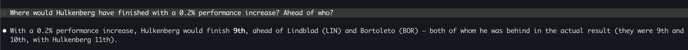

# LICENSE

USE SUBJECT TO AND AGREEMENT WITH THE LICENSE AS DESCRIBED IN THE DATASET: https://github.com/TracingInsights/RaceData/blob/main/LICENSE

# Test Me

[Install uv](https://docs.astral.sh/uv/getting-started/installation/), and then:

```sh
uv run pytest stats/test_stats.py
```

# Run Me

There are many ways to use this program.

## As a Bot - RECOMMENDED

### Claude Code

[Get Claude Code](https://code.claude.com/docs/en/overview) and login, then launch it.

It will use `.skills/` directory from the root.

Start talking, and you should see:

```sh
⏺ Skill(driver-performance)
Successfully loaded skill
```

**That's it - just run `claude` from this directory and ask it about driver performance!**

* "Give me the driver performances"
* "Give me Hulkenberg's performance"
* "Where would Hulkenberg have finished with a 0.2% performance increase?"



## As a Standalone Package

Run straight from [uv](https://docs.astral.sh/uv/):

```sh
cd api/
uv run main.py
```

### Get One Driver's Data

```sh
cd api/
uv run main.py HUL
```

### Give One Drivers a Percentage Performance Improvement (All Sessions)

```sh
cd api/
uv run main.py HUL 5
```

## As a Py CLI

Launch it:

```sh
cd api/
uv run uvicorn api:app --reload
```

Push it:

```sh
# Start (from repository root dir)
docker compose up -d --build

# Make some calls
docker exec -it f1-laps-api uv run python main.py
docker exec -it f1-laps-api uv run python main.py HUL
docker exec -it f1-laps-api uv run python main.py HUL 0.2

# Bin it
docker compose kill
```

## As an API

Launch it:

```sh
cd api/
uv run uvicorn api:app --reload
```

Call it:

```sh
http GET :8000/performance                # All session
http GET :8000/performance/HUL            # Hulkenberg best
http POST :8000/performance/HU/upgrade/5  # Hulkenberg 5% perf increase
http DELETE :8000/performance             # Reset
```

### All-in-one Py Bot

⚠️⚠️ I DID NOT FINISH THIS ⚠️⚠️

Get Docker of any kind, and then:

```sh
ANTHROPIC_API_KEY=KEY_HERE docker compose up
```

Talk to it.

Ctrl+C to exit.
